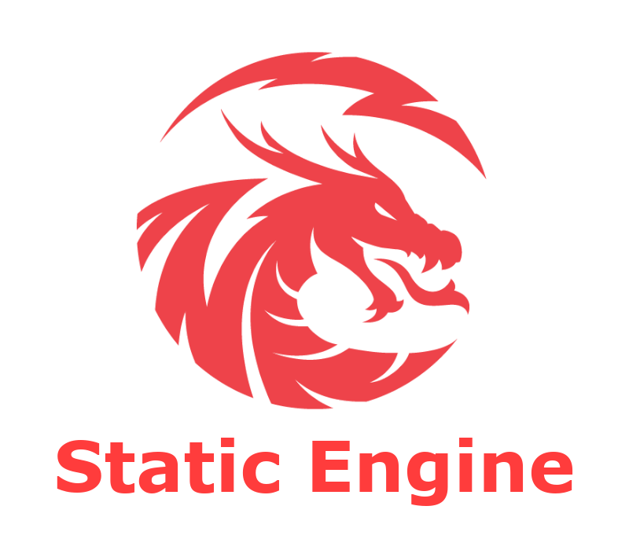

<div align="center">


---

<h2 style="font-size: 28px">An Open Source 2D and 3D Game Engine</h2>
<h3 align="center">Built with C++</h3>
</div>

<br>
<br>

## Supported Platforms:

- **Linux**
- **Windows**

## Features

- **2D and 3D Rendering**
- **Post-Processing Effects**
- **Project Manager**
- **Multi language scripting: C#, Lua, C++ (C++ is Linux Only)**
- **Physics Engine: Box2D, Bullet Physics (3D)**
- **Audio**
- **Level Editor**
- **2D Lighting**
- **3D Lighting**
- **More coming soon**

## Used Dependencies

- **Assimp**
- **Box2D**
- **Discord RPC**
- **Freetype**
- **ImGuizmo**
- **EnTT**
- **GLAD**
- **GLFW**
- **glm**
- **IconFontCppHeaders**
- **ImGui**
- **ImGuiFileDialog**
- **nlohmann json**
- **SDL/SDL_mixer**
- **stb_image**
- **tinyxml**
- **Bullet Physics**
- **OpenAL**
- **FileWatch**
- **Freetype**
- **luajit**
- **sndfile**

# Huge thanks to

- **Blood demon for remaking the logo and making the banner! https://twitter.com/ecto_demon**

# Installation

Create folders: **bin** and **bin_win** first! \
Remember: **You need to compile linux and windows game binaries if you want cross-platform building to work!**

## **Linux**

```bash
git clone https://github.com/koki10190/Vault-Engine.git
cd Vault-Engine
make projects
make linux
make linux_game
make win
make win_game
make win_cxx
./Vault\ Engine.sh
```

If it fails you probably do not have G++ and make installed.

### C++ Scripting

To make cross-platform games you must have x86_64-w64-mingw32 and g++ installed so that you can compile C++ Script code (if you use C++ otherwise ignore this)

## **Windows**

Go to **Makefile** and edit **MINGW_COMPILER**
NOTE: You need to have **ar** on windows installed! (I do not know if it is on windows tho I am sure it is)

```bash
git clone https://github.com/koki10190/Vault-Engine.git
cd Vault-Engine
make projects_win
make win
make win_game
make win_cxx
.\windows\win_proj.exe
```

### **Bundling**

Bundling the application is very easy! just use the bash/batch script!

On Linux

```bash
./bundle.sh # this will bundle for linux, in dist/linux
./bundle.sh windows # this will bundle for windows, in dist/windows
```

On Windows

```bash
./bundle.bat # this will bundle for linux, in dist/linux
./bundle.bat windows # this will bundle for windows, in dist/windows
```

NOTE: Building is still being worked on!

# **Cross-Platform Issues**

- 3D Audio - Linux build is able load mp3 files while windows build can only load WAV files. (this is an issue with sndfile)
- C++ Scripts on windows work but the global variables that the EXE File uses for GameObjects and Logs and what not are not shared between the DLL Files.

# **C# Scripting**

If you want to use C# for scripting **you need to have dotnet and the sdk installed!** and the path set!

# Upcoming Features

- **Asset Packager**
- **Android Support**
- **Flowchart Editor (like in Unreal Engine)**
- **Video Player**
- **Batch Renderer**

# TODO: EXPORT ALL CLASSES, VARIABLES & FUNCTIONS
