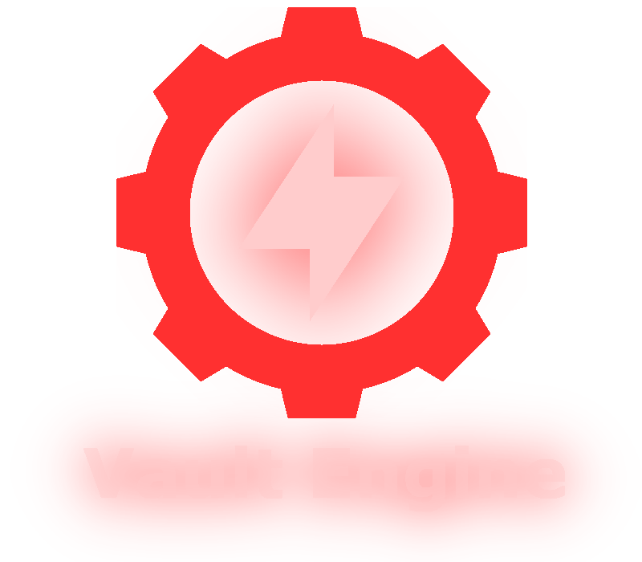

<div align="center">


---

<h3>An Open Source 2D and 3D Game Engine</h3>
<p align="center">Built with C++</p>
</div>

<br>
<br>

## Supported Platforms:

-   **Linux**
-   **Windows**

## Features

-   **2D and 3D Rendering**
-   **Post-Processing Effects**
-   **Project Manager**
-   **Script Engine: Lua**
-   **Physics Engine: Box2D, Bullet Physics (3D)**
-   **Audio: SDL_mixer**
-   **Level Editor**
-   **Native Scripting**
-   **2D Lighting**
-   **3D Lighting**
-   **More coming soon**

## Used Dependencies

-   **Assimp**
-   **Box2D**
-   **Discord RPC**
-   **Freetype**
-   **ImGuizmo**
-   **EnTT**
-   **GLAD**
-   **GLFW**
-   **glm**
-   **IconFontCppHeaders**
-   **ImGui**
-   **ImGuiFileDialog**
-   **nlohmann json**
-   **SDL/SDL_mixer**
-   **stb_image**
-   **tinyxml**
-   **Bullet Physics**
-   **OpenAL**
-   **luajit**

# Installation

### **Linux**

```bash
git clone https://github.com/koki10190/Vault-Engine.git
cd Vault-Engine
make projects
make linux
./Vault\ Engine.sh
```

If it failes you probably do not have G++ and make installed.

### **Windows**

Go to **Makefile** and edit **MINGW_COMPILER**

```bash
git clone https://github.com/koki10190/Vault-Engine.git
cd Vault-Engine
make projects_win
make win
.\windows\win_proj.exe
```

### **Bundling**

Bundling the application is very easy, this only works on linux since i do not have .bat file for this created

```bash
./bundle.sh # this will bundle for linux, in dist/linux
./bundle.sh windows # this will bundle for windows, in dist/windows
```

NOTE: while building is implemented, it will not work as of now!

# Upcoming Features

-   **Vulkan Rendering**
-   **JavaScript Scripting**
-   **Python Scripting**
-   **Full C++ Scripting support**
-   **Asset Packager**
-   **Android Support**
-   **Flowchart Editor (like in Unreal Engine)**
-   **Video Player**
